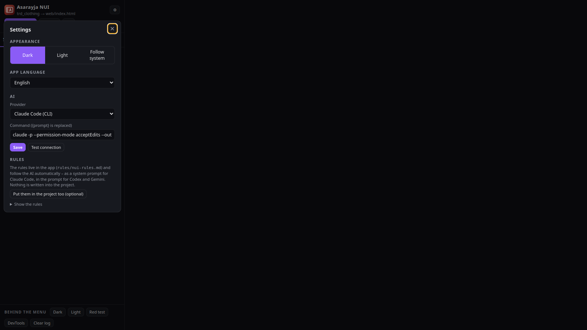
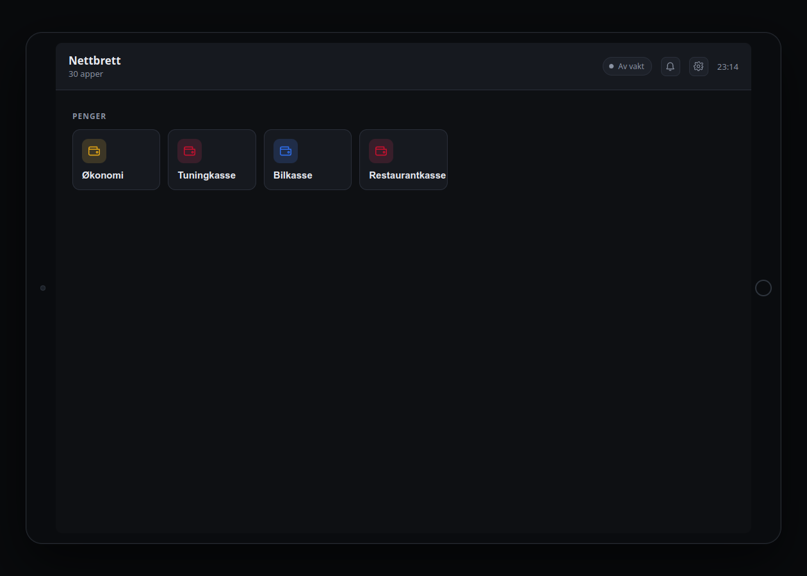

<h1 align="center">Asarayja NUI Tools</h1>

See, edit and build FiveM NUI menus outside the game.

**English** · [Norsk](#norsk)

Asarayja NUI Tools opens any FiveM resource folder and shows its NUI the way the game would: it
reads the Lua for every `SendNUIMessage`, guesses the data, answers the page's callbacks, and lets
you edit the HTML/CSS/JS live. On top of that: templates for new scripts, an AI tab that works with
Claude Code, Codex or Gemini under a fixed rule set for NUI, a Git tab, and phone-app support
(LB Phone, NPWD).

**Download:** [Releases](../../releases) – Linux AppImage / deb, Windows portable / installer.

## What it does

- **Scenes** – every message Lua can send is a button. Lists that Lua fills at runtime are filled from
  the script's own config tables; a recorder resource can capture real data from the game.
- **Parts** – the sections of a page, so a hidden admin panel can be shown without the right message.
- **Scripts** (workspace) – pick a folder holding many scripts: every one is listed in a collapsible box with
  its links to the others (exports, events, callbacks, dependencies, images). Show one menu at a time; the AI works
  from the folder itself, so one job can touch several scripts. It can never edit the rules file. The scripts it
  touched are listed, and `Ctrl+Tab` / `Ctrl+Shift+Tab` switch the view between them, loaded fresh.
- **Editor** (Ctrl+E) – CSS is applied while you type, HTML/JS on pause. Syntax colours.
- **New script** – templates with locales (no/en/sv/da/de), `Config.Locale`, English comments:
  NUI menu, Node-built NUI (Vite + React), LB Phone app, NPWD app (the Qbox default phone),
  clothing / barber / tattoo menu (plain or React), no-NUI.
- **AI** – a live conversation with Claude Code inside the resource (permission questions answered in
  the chat), or one-shot turns with Codex, Gemini CLI, GitHub Copilot CLI, Cline, Blackbox AI, OpenCode,
  Aider or Qwen Code; plus Ollama / Anthropic / OpenAI / Gemini over API. The NUI rules, the open file,
  the scene on screen and the page's errors travel with every request.
- **Git** – status, commit (AI-written message), push, create the repo on GitHub, GitHub login.
- **Rules** – `rules/nui-rules.md`: the focus/open-close contract, no blocking dialogs, CSS that
  survives the transparent CEF surface, callbacks, locales, LB Phone, NPWD, clothing menus.
- App language: English by default; Norwegian, Swedish, Danish, German in Settings. Dark/light.

## Install

- **Linux:** `sudo apt install ./Asarayja\ NUI\ Tools-<version>-linux.deb`, or make the AppImage
  executable and run it (needs `libfuse2`, or `--appimage-extract-and-run`).
- **Windows:** run the portable `.exe`, or the setup installer. SmartScreen warns the first time
  (the build is not signed yet) – choose "Run anyway".
- For the AI tab, install the CLI you want and log in once: [Claude Code](https://docs.anthropic.com/claude-code)
  (`claude`), Codex (`codex`), Gemini CLI (`gemini`), GitHub Copilot CLI (`copilot`), Cline (`cline`),
  Blackbox (`blackbox`), OpenCode (`opencode`), Aider (`aider`) or Qwen Code (`qwen`). The command line each
  one is run with is editable under ⚙. For the Git tab: `git` and [`gh`](https://cli.github.com).

## Recorder

To see real data instead of guesses, copy `resources/recorder` (inside the app folder) to your
server as `asarayja-nui-recorder`, add two lines to the script's `fxmanifest.lua` (the Callbacks tab
shows them), use the menu in game, and open the resource again.

---

## Norsk

Asarayja NUI Tools åpner en hvilken som helst FiveM-ressurs og viser NUI-en slik spillet ville
gjort det: leser Lua-en for hver `SendNUIMessage`, gjetter dataene, svarer på sidas callbacks og
lar deg redigere HTML/CSS/JS live. I tillegg: maler for nye scripts, en AI-fane som jobber med
Claude Code, Codex eller Gemini under et fast regelsett for NUI, en Git-fane, og støtte for
telefon-apper (LB Phone, NPWD).

**Last ned:** [Releases](../../releases) – Linux AppImage / deb, Windows portable / installer.

- Linux: `sudo apt install ./Asarayja\ NUI\ Tools-<versjon>-linux.deb`, eller kjør AppImage-en
  (trenger `libfuse2`, ellers `--appimage-extract-and-run`).
- Windows: portable `.exe` eller installereren. SmartScreen advarer første gang (ikke signert ennå).
- AI-fanen trenger CLI-en du vil bruke i PATH (`claude`, `codex` eller `gemini`), Git-fanen `git` og `gh`.
- Språk i appen velges under ⚙ (engelsk standard; norsk, svensk, dansk, tysk).

Dokumentasjonen bygges ut her; kildekoden ligger i et privat repo.
